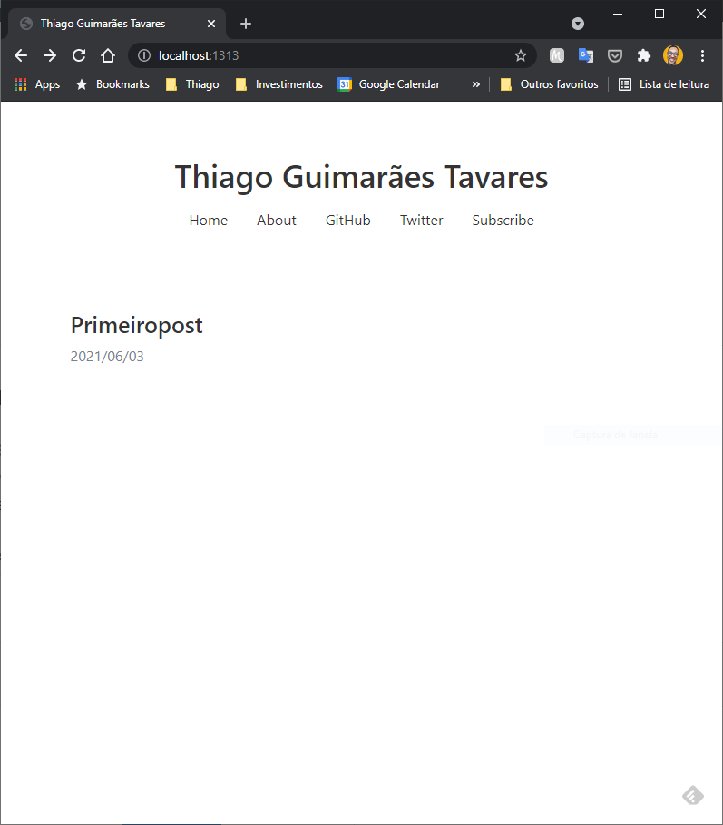
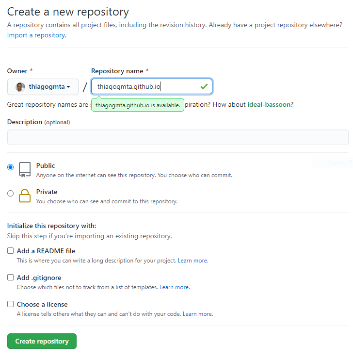
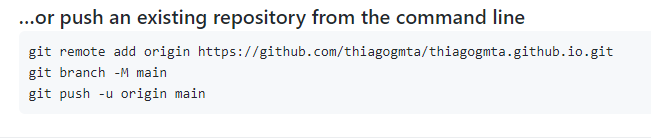

## 1. Instalando Dependências

Podemos trabalhar com o Hugo Blog em qualquer sistema operacional, basta apenas instalar os pacotes necessários. Para este guia iremos instalar os seguintes aplicativos:

- Gerenciador de Pacotes
  - Homebew para Linux
  - Chocolatey para Windows
- Git
  - O Git será nosso sistema de controle de versões. É responsável por iniciar nosso repositório e realizar o controle de versão dos arquivos.
- Hugo
  - Hogo é um gerador de site. Ele converte nosso artigo escrito em Markdown para paginas html
- Typora
  - Utilizaremos o Typora como editor de texto simples. O Typora é um editor markdown Distraction Free (livre de distrações)

A seguir você encontra o processo de instalação de ambos os pacotes para os sistemas Linux e Windows. Realize o processo de instalação de acordo com o seu sistema operacional. A partir do tópico 2 deste artigo os passos são os mesmos para qualquer sistema.

### Linux

- Homebrew e git

Instalando Git e dependências:

```bash
$ sudo apt-get install build-essential curl file git
```

Instalando Homebew

```bash
$ /bin/bash -c "$(curl -fsSL https://raw.githubusercontent.com/Homebrew/install/master/install.sh)"
```

Realizando configurações:

```bash
$ test -d ~/.linuxbrew && eval $(~/.linuxbrew/bin/brew shellenv)
$ test -d /home/linuxbrew/.linuxbrew && eval $(/home/linuxbrew/.linuxbrew/bin/brew shellenv)
$ test -r ~/.bash_profile && echo eval" ($(brew --prefix)/bin/brew shellenv)" >>~/.bash_profile
$ echo "eval $($(brew --prefix)/bin/brew shellenv)" >>~/.profile
```

- hugo

```bash
$ brew install hugo
```

### Windows

- chocolatey
  - Chocolatey é um gerenciador de pacotes para o Windows. Iremos instalar nossas dependências através dele.
  - 1 - Abra o prompt de comandos (ou powershell) como administrador. Clique com o botão direito no menu iniciar e selecione Windows PowerShell (Admin).
  - Cole e execute o comando a seguir:

```shell
> Set-ExecutionPolicy Bypass -Scope Process -Force; [System.Net.ServicePointManager]::SecurityProtocol = [System.Net.ServicePointManager]::SecurityProtocol -bor 3072; iex ((New-Object System.Net.WebClient).DownloadString('https://chocolatey.org/install.ps1'))
```

Com o chocolatey instalado basta instalar os pacotes a seguir através do Prompt de Comandos (ou PowerShell).

- git

```shell
c:\> choco install git
```

- hugo

```bash
c:\> choco install hugo -confirm
```

- Typora

```shell
c:\> choco install typora
```


## 2. Criando nosso Blog

A seguir seguem os passos para criação do blog seleção do tema e configurações iniciais.

## 2.1. Criando o blog

Através do prompt de comandos ou terminal execute:

```bash
$ hugo new site thiagogmta
```

Nesse caso thiagogmta será o nome do diretório onde os arquivos do blog serão instalados. Posteriormente iremos acessar o diretório criado e inicializar o repositório.

```bash
$ cd thiagogmta
$ git init
```

### 2.2. Selecionando um tema

Existem diversos temas disponíveis para serem usados e você pode conferir a lista completa acessando [Hugo Themes](https://themes.gohugo.io/).

Para este artigo utilizaremos o Tema [**Tanka**](https://themes.gohugo.io/hugo-tanka/).


**Instalação**

O procedimento descrito a seguir é padrão para qualquer tema, entretanto alguns temas podem exigir configurações adicionais que normalmente estão descritas na página do tema.

Iremos utilizar o git para clonar os arquivos do tema para dentro do diretório **themes** em nosso repositório. Para isso iremos executar:

```bash
$ git submodule add https://github.com/nanxstats/hugo-tanka.git themes/hugo-tanka
```

**Configuração**

Dentro do nosso repositório existe um arquivo chamado *config.toml*. Esse arquivo possui as configurações do nosso projeto. Na pagina do tema existem algumas instruções sobre quais informações devem ser inseridas. Altere o arquivo de forma a se a presentar conforme a baixo:

```toml
baseURL = "https://example.com"
languageCode = "pt-br"
DefaultContentLanguage = "pt-br"
title = "Thiago Guimarães Tavares"
theme = "hugo-tanka"

enableEmoji = true
pygmentsstyle = "vs"
pygmentscodefences = true

[params]
  sitename = "Thiago Guimarães Tavares"
  faviconfile = "images/favicon.png"
  highlightjs = true
  highlightjslanguages = ["r", "python", "stan"]
  uselatex = true

[[menu.primary]]
    name = "Home"
    url = "/"
    weight = 1
[[menu.primary]]
    name = "About"
    url = "/about/"
    weight = 2
[[menu.primary]]
    name = "GitHub"
    url = "https://github.com/nanxstats"
    weight = 3
[[menu.primary]]
    name = "Twitter"
    url = "https://twitter.com/nanxstats"
    weight = 4
[[menu.primary]]
    name = "Subscribe"
    url = "/index.xml"
    weight = 5
```

### 2.3. Criando o primeiro post

Dentro do repositório execute o comando:

```bash
$ hugo new primeiropost.md
```

Algumas considerações:

- hugo new post - Comando responsável por criar o post
- primeiropost.md - Nome do arquivo.
  - Procure não utilizar espaços
  - A extensão deve ser .md

Iremos agora utilizar o Typora para fazer a edição do post criado. Abra o Typora e carregue o arquivo primeiropost.md.

1. Arquivo abrir.
2. <diretório do repositório>/content/posts/primeiropost.md

Dentro do arquivo você iremos nos deparar com alguns dados iniciais. Altere as informações conforme a seguir:

```
---
title: "Criando meu Primeiro post"
date: 2021-06-03T10:26:04-03:00
draft: false
---

Este é meu primeiro post utilizanod Hugo Blog!

## Sobre este post

É apenas um post de teste
```

> Observação:
>
> O parâmetro **draft** define se o post irá estar visível ou não.
>
> draft: false - Post ficará visível
>
> draft: true - Post não será exibido
>
> Essa função serve para você definir quais posts devem ser exibidos sem excluir arquivos que você ainda quer manter.

## 2.4. Testando

Para testar nosso projeto execute no prompt ou no terminal (na raiz do diretório do projeto):

```bash
$ hugo server
```

Você deve receber uma mensagem como a seguir:

```bash
Start building sites …

                   | PT-BR
-------------------+--------
  Pages            |     7
  Paginator pages  |     0
  Non-page files   |     0
  Static files     |     2
  Processed images |     0
  Aliases          |     0
  Sitemaps         |     1
  Cleaned          |     0

Built in 20 ms
Watching for changes in C:\Users\thiag\Dropbox\thiagogmta\{archetypes,content,data,layouts,static,themes}
Watching for config changes in C:\Users\thiag\Dropbox\thiagogmta\config.toml
Environment: "development"
Serving pages from memory
Running in Fast Render Mode. For full rebuilds on change: hugo server --disableFastRender
Web Server is available at http://localhost:1313/ (bind address 127.0.0.1)
Press Ctrl+C to stop
```

Basta abrir o navegador de internet e digitar: http://localhost:1313.

Eis o resultado:



## 3. Enviado os arquivos para o github

Acesse sua conta e crie um repositório conforme: <seu_usuario>.github.io. No meu caso **thiagogmta.github.io**. Observe a seguir:



Ao criar o repositório algumas informações para enviar os arquivos serão apresentadas. Para este caso utilizaremos as instruções a seguir:



Dessa forma abra seu terminal e execute (altere a primeira linha conforme o link do seu repo):

```bash
$ git remote add origin https://github.com/thiagogmta/thiagogmta.github.io.git
$ git branch -M main
$ git add .
$ git commit -m "Meu primeiro commit"
$ git push origin main
```

Seu nome de usuário e senha do github serão solicitados. Por fim os arquivos serão enviados ao github.

**Configurando a Integração entre Hugo e Github**

Precisamos criar um arquivo de configuração que intermedia a integração entre Hugo e Github. Crie o arquivo gh-pages.yml dentro do diretório do seu projeto. Neste caso: **/thiagogmta/.github/workflows/gh-pages.yml**. 

